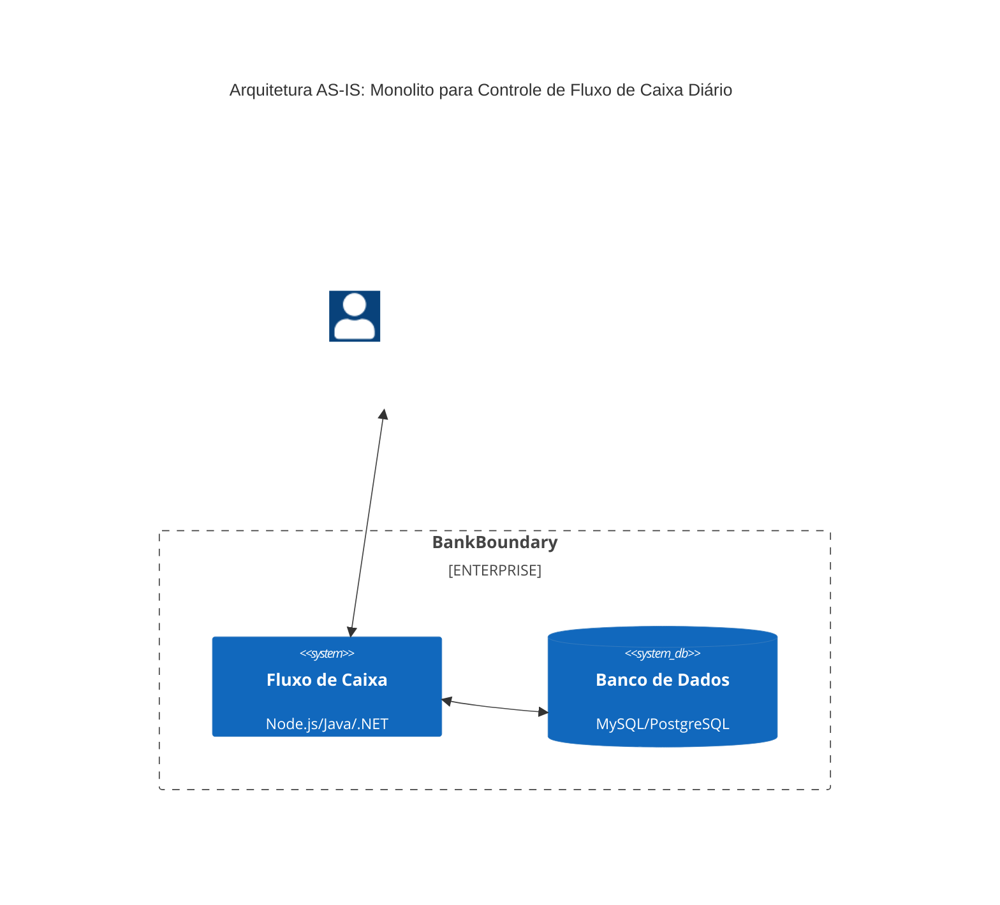

# Controle de Fluxo de Caixa Diário - Arquitetura AS-IS

Foi imaginado um cenário atual hipotético para servir como base para a evolução da solução.  

## 1. Descrição da Arquitetura AS-IS Monolítica

### Aplicação Centralizada
- Toda a lógica de negócio e processamento está em uma única aplicação monolítica, hospedada em um servidor físico ou em uma instância única de VM.
- Todos os módulos de cadastro, consulta, consolidação e relatórios são implementados em um único código-fonte, com baixa separação de responsabilidades.

### Banco de Dados Único
- Um banco de dados relacional centralizado gerencia todos os dados dos lançamentos e relatórios.
- Consultas e transações são diretas e dependentes de uma conexão constante e com alta concorrência, sobrecarregando a camada de banco de dados, especialmente em horários de pico.

### Processamento Sincrônico
- Processos de consolidação diária e consultas são executados diretamente no monolito, de maneira sincrônica. 
- O processo de consolidação pode atrasar ou bloquear o cadastro e a consulta de lançamentos em horários de pico, devido ao alto volume de dados sendo processado ao mesmo tempo.

### Escalabilidade Limitada

- A aplicação não é escalável horizontalmente, o que significa que aumentar a capacidade exige adicionar mais recursos ao servidor (escala vertical).
- Em períodos de pico, a carga elevada gera aumento nos tempos de resposta, podendo ultrapassar os 200 ms exigidos para cadastro e consulta de lançamentos.

### Monitoramento e Observabilidade

- Não há monitoramento de métricas detalhadas, e o monitoramento disponível é básico, focado apenas na disponibilidade da aplicação.
- Logs não são estruturados ou centralizados, dificultando a identificação rápida de problemas de desempenho e disponibilidade.

### Resiliência e Recuperação Limitadas

- Não há mecanismo de failover; qualquer falha no servidor ou no banco de dados impacta diretamente a disponibilidade da aplicação.
- A aplicação não possui armazenamento em fila para mensagens, o que pode resultar em perda de dados durante falhas de conexão ou indisponibilidade do banco.

### Segurança Básica

- A autenticação e autorização podem ser configuradas, mas não há criptografia para dados sensíveis no banco de dados.
- Logs de auditoria são limitados, e não existe rastreamento detalhado de acesso ou modificação de dados.

### Integração com ERPs Externa Limitada

- A integração com ERPs ou outros sistemas externos ocorre de forma direta, provavelmente através de scripts de importação/exportação de dados.
- A falta de APIs RESTful dedicadas ou suporte a formatos modernos de dados (como JSON) dificulta a integração.

## 2. Problemas Chave

- **Escalabilidade e Desempenho**: A arquitetura monolítica e a ausência de estratégias para um processamento desacoplado dificultam a expansão e o atendimento aos requisitos de desempenho em momentos de alta demanda.

- **Disponibilidade e Resiliência**: Falhas no servidor podem afetar a disponibilidade da aplicação. A ausência de redundância e failover eleva o risco de downtime.

- **Manutenibilidade e Evolução**: Alterações e evoluções na aplicação exigem mudanças no código monolítico, aumentando o tempo de deploy e o risco de interrupções.

- **Segurança e Conformidade**: Dados sensíveis não são criptografados e não há um rastreamento confiável de modificações, dificultando auditorias e a conformidade com boas práticas de segurança.

## 3. Diagrama C4 - Nível de Contêiner da Arquitetura AS-IS

