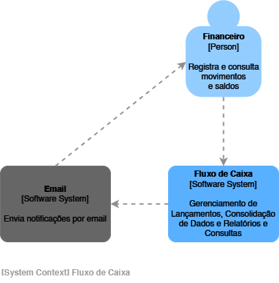
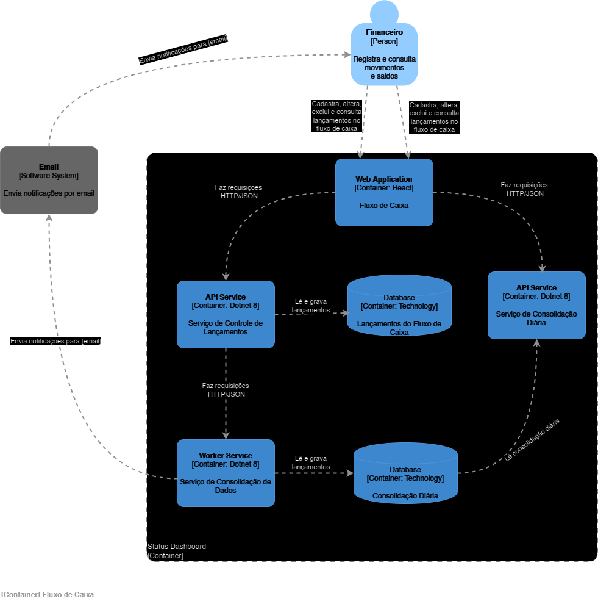
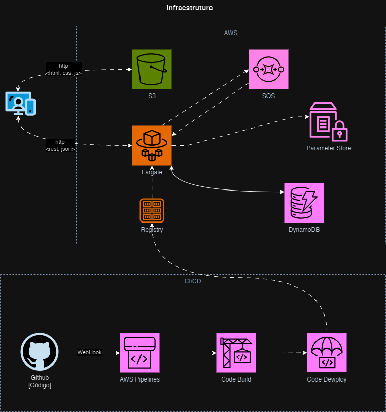

# Proposta de Solução

## Mapeamento de Domínios Funcionais e Capacidades de Negócio

O Mapeamento de Domínios Funcionais e Capacidades de Negócio é uma prática usada em arquitetura empresarial e desenvolvimento de software para alinhar os objetivos do negócio com a arquitetura dos sistemas e as funcionalidades que eles oferecem.

### Domínios Funcionais

São áreas amplas do negócio ou sistema que agrupam funcionalidades relacionadas e possuem um propósito comum. Eles ajudam a dividir o sistema em partes gerenciáveis e independentes. Esses domínios geralmente refletem as áreas de atuação da organização e guiam como os sistemas devem ser organizados e integrados.

No caso da solução em questão, são abordados os seguintes domínios.

1. Gerenciamento de Lançamentos
2. Consolidação de Dados
3. Relatórios e Consultas
4. Notificações
5. Infraestrutura e Segurança

---

### Capacidades de Negócio

São as habilidades ou competências que uma organização precisa para atingir seus objetivos estratégicos. Elas representam o "o quê" uma organização deve ser capaz de fazer, sem se preocupar com o "como" será feito. Essas capacidades são mapeadas para garantir que os sistemas e processos de TI estão suportando as necessidades do negócio.

No caso da solução em questão, são identificadas as seguintes capacidades de negócio.

#### **1. Gerenciamento de Lançamentos**

- **Cadastrar lançamentos** com informações detalhadas (data, valor, categoria e descrição).
- **Validar dados dos lançamentos**, como impedir datas futuras e valores negativos.
- **Armazenar lançamentos em filas duráveis** para garantir resiliência.
- **Garantir registro em tempo real**, suportando alta disponibilidade.

#### **2. Consolidação de Dados**

- **Gerar relatórios consolidados diários**, incluindo totais de créditos, débitos e saldo final.
- **Consolidar lançamentos por categoria** para análises detalhadas.
- **Permitir agendamento da consolidação** para automação.
- **Assegurar processamento eficiente**, mesmo em períodos de alta carga.

#### **3. Relatórios e Consultas**

- **Permitir consultas de lançamentos** por período, categoria e tipo (débito/crédito).
- **Gerar relatórios de fluxo de caixa** para qualquer intervalo de tempo, com saldo inicial e final.
- **Exportar relatórios para PDF e Excel**.
- **Assegurar tempo de resposta ágil** para consultas.

#### **4. Notificações**

- **Notificar falhas na consolidação diária** para alertar usuários de problemas.
- **Confirmar a conclusão da consolidação diária** por meio de notificações automáticas.

## Documento de Requisitos

### **Visão Geral**

A nova versão do sistema de Controle de Fluxo de Caixa inclui o gerenciamento de lançamentos diários (débitos e créditos) e a geração de um relatório diário consolidado. Cada lançamento possui informações detalhadas sobre data, valor, categoria e descrição para facilitar a organização e análise do fluxo de caixa.

### **Requisitos Funcionais**

1. **Cadastro de Lançamento**
   - O sistema deve permitir o cadastro de um novo lançamento de débito ou crédito.
   - **Atributos do Lançamento**:
     - **Data**: Data em que o lançamento foi realizado.
     - **Valor**: Valor numérico; positivo para créditos e negativo para débitos.
     - **Categoria**: Tipo de lançamento, com categorias predefinidas como "Folha de Pagamento", "Fornecedores", "Compras", etc.
     - **Descrição**: Texto opcional para detalhar o motivo ou a natureza do lançamento.
   - **Regras de Negócio**:
     - A data não pode ser futura.
     - O valor deve ser maior que zero (considera-se que o tipo — débito ou crédito — já diferencia valores positivos e negativos).

2. **Consulta de Lançamentos**
   - O sistema deve permitir a consulta de lançamentos por:
     - Período de tempo (data inicial e final).
     - Categoria.
     - Tipo (débito ou crédito).
   - A consulta deve retornar todos os atributos dos lançamentos.

3. **Consolidação Diária**
   - O sistema deve gerar um relatório diário consolidado com o saldo total dos lançamentos do dia, dividido em:
     - Total de Créditos.
     - Total de Débitos.
     - Saldo Final (Créditos - Débitos).
   - A consolidação deve incluir a soma dos lançamentos por categoria.
   - O sistema deve permitir agendar a geração do consolidado diário ao final do dia.

4. **Relatório de Fluxo de Caixa**
   - O sistema deve gerar relatórios de fluxo de caixa para qualquer período selecionado, com:
     - Saldo inicial e saldo final do período.
     - Valores consolidados por categoria.
   - Deve permitir exportação para PDF ou Excel.

5. **Notificações de Consolidação**
   - Notificar o usuário caso a geração do consolidado diário apresente falhas.
   - Notificar a conclusão da consolidação diária.

### **Requisitos Não Funcionais**

1. **Disponibilidade**
   - O sistema de controle de lançamentos deve manter uma disponibilidade mínima de 99,9% durante o horário de 7h as 20h.
   - O serviço de consolidação diária deve suportar até 50 requisições por segundo em períodos de pico, com no máximo 5% de falhas.

2. **Escalabilidade**
   - A solução deve ser escalável horizontalmente para atender ao crescimento na carga de trabalho.
   - Serviços Controle de Lançamentos e Consolidação Diária devem ser projetados para funcionar de maneira independentente.

3. **Desempenho**
   - Para assegurar uma experiência ágil e interativa para o usuário, o sistema deve ser responsivo e permitir registros e consultas rápidas, evitando frustrações durante o uso.
   - O tempo médio de resposta no backend para cadastro e consulta de lançamentos deve ser inferior a 200 ms.
   - O processo de consolidação diária deve ocorrer em até 2 minutos para volumes de até 10 mil lançamentos.

4. **Resiliência e Recuperação**
    - **Serviço de Controle de Lançamentos**:
        - Este serviço é essencial para que o comerciante registre débitos e créditos em tempo real. A indisponibilidade dele interrompe a capacidade de registrar transações, o que pode prejudicar o controle financeiro diário.
        - Deve ter redundância para manter o serviço disponível mesmo em caso de falha em um nó.
        - Mensagens de entrada (dados de novos lançamentos) devem ser armazenadas em uma fila durável, garantindo que transações não sejam perdidas.

    - **Serviço de Consolidação Diária**
        - Este serviço gera relatórios que são fundamentais para o acompanhamento do fluxo de caixa consolidado ao final de cada dia. Embora o impacto da sua indisponibilidade seja menos imediato, ele é essencial para a análise e planejamento financeiro.
        - Deve operar de forma assíncrona e ser capaz de processar dados acumulados quando voltar à operação após uma falha.
        - Deve utilizar filas para comunicação, armazenando os lançamentos a consolidar até que o serviço esteja disponível.

5. **Segurança**
   - Implementar autenticação e autorização, garantindo acesso seguro aos dados dos lançamentos.
   - Dados sensíveis, como valores e categorias dos lançamentos, devem ser armazenados de forma criptografada.
   - Implementar logs de auditoria para rastreamento de acessos e modificações.

6. **Monitoramento e Observabilidade**
   - Implementar métricas e logs para monitorar a saúde e o desempenho do sistema.
   - Configurar alertas para falhas, tempos de resposta elevados e problemas de conexão entre serviços.

7. **Manutenibilidade**
   - O código e as configurações da solução devem ser documentados e modularizados para facilitar manutenções e futuras melhorias.

8. **Portabilidade**
   - O sistema deve ser compatível com diferentes ambientes de execução (cloud, on-premises) para permitir flexibilidade de infraestrutura.

9. **Compatibilidade**
   - O sistema deve permitir integração com outros sistemas de ERP para importação e exportação de dados financeiros, preferencialmente usando APIs RESTful ou formatos de arquivos padrão como CSV e XML.

### **Considerações Finais a Respeito dos Requisitos**

Esses requisitos fornecem uma base para garantir que o sistema atenda às necessidades do comerciante, possibilitando um fluxo de caixa eficiente, seguro e confiável. Os requisitos não funcionais, como escalabilidade, segurança e resiliência, garantem a confiabilidade, o desempenho da solução, boa experiência dos usuáriosm, e eficiência operacional.

## Desenho da solução completo (Arquitetura Alvo)

A solução será baseada em uma arquitetura de microsserviços para garantir escalabilidade, resiliência e manutenção modular.  
Os serviços de backend serão construídos em **.NET 8**, o frontend em **React**, e será adotado um banco de dados noSql **Amazon DynamoDB**.  
A comunicação assíncrona será feita com **AWS SQS** para maior resiliência e suporte a alta disponibilidade.

### 1. **Frontend**  

- **Framework**: React  
- **Linguagem**: TypeScript  
- **Responsabilidade**:
  - Cadastro e consulta de lançamentos.  
  - Visualização de relatórios e notificações.  
  - Geração de relatórios (PDF/Excel).  
- **Comunicação**: APIs RESTful.

### 2. **Backend (Microsserviços em .NET 8)**  

#### **Serviço de Controle de Lançamentos**

- Cadastro e validação de lançamentos.  
- Enfileiramento de mensagens para o serviço de consolidação.  

#### **Serviço de Consolidação de Dados**

- Processamento e consolidação dos lançamentos em relatórios diários.
- Envio de notificações (sucesso ou falha) de consolidação para usuários via email ou push notifications.

### 3. **Infraestrutura e Suporte**

- **Banco de Dados**: Amazon DynamoDB um banco de dados NoSql gerenciado escalável.  
- **Mensageria**: AWS SQS para filas duráveis e comunicação entre microsserviços.  
- **Logs e Observabilidade**: Serilog integrado com Elasticsearch e Kibana para monitoramento e auditoria.  

### 4. **Segurança**

- Autenticação via **OAuth 2.0** com tokens JWT.
- Criptografia de dados sensíveis, caso necessário, com AES.
- Autorização baseada em roles para restrição de acesso.

## **Arquitetura de Implantação**

- **Ambiente Cloud**: AWS Fargate para os microsserviços backend e Bucket S3 para o front.  
- **Pipeline CI/CD**: Github actions com stages para build+teste e deployment.  
- **Infraestrutura**: Orquestrada com Docker Compose para desenvolvimento local e Kubernetes (usando o Fargate) para produção.

## **Fluxo de Comunicação**

1. O frontend comunica-se com os serviços backend via REST API.  
2. Lançamentos registrados são validados e enfileirados no AWS SQS.  
3. O serviço de consolidação consome mensagens do AWS SQS, processa os dados e armazena relatórios no banco.  
3.1. O serviço enviando alertas de sucesso/falha ao término do processamento.  
4. Consultas e relatórios são acessados via frontend diretamente nos serviços de controle de fluxo de caixa e de Consolidação diária, que realizam consultas otimizadas ao banco.

## **Justificativa na decisão/escolha de ferramentas/tecnologias e de tipo de arquitetura**

### **Tipo de Arquitetura**

A arquitetura de microsserviços proporciona a flexibilidade, a escalabilidade e a resiliência necessárias para atender aos requisitos da solução proposta, garantindo uma base sólida para expansão futura.

A escolha da arquitetura baseada em microsserviços para esta solução é justificada pelos seguintes motivos:

#### **1. Escalabilidade**

- Cada serviço pode ser escalado independentemente, garantindo que apenas os componentes com maior demanda (e.g., consolidação de dados ou notificações) recebam mais recursos, otimizando custos.

#### **2. Isolamento de Falhas**

- Problemas em um serviço não impactam diretamente os demais. Por exemplo, uma falha no serviço de notificações não afetará o cadastro de lançamentos ou a geração de relatórios.

#### **3. Manutenção e Evolução**

- A modularidade permite que equipes diferentes trabalhem em serviços distintos sem interferências, acelerando o desenvolvimento e facilitando a implementação de novas funcionalidades.

#### **4. Tecnologias Heterogêneas**

- A arquitetura permite que tecnologias diferentes sejam usadas para cada serviço, caso necessário.
  - Embora neste projeto todos sejam em .NET 8, no futuro, um serviço poderia ser reescrito ou complementado com outra tecnologia.

#### **5. Comunicação Assíncrona**

- A utilização de um broker de mensagens facilita a construção de sistemas reativos e desacoplados, garantindo processamento eficiente e tolerância a latência.

#### **6. Adequação à Complexidade do Sistema**

- A solução envolve múltiplos domínios (lançamentos, consolidação, notificações, relatórios).
- Microsserviços permitem separar claramente essas responsabilidades, mantendo o código limpo e alinhado com princípios de **Single Responsibility**.

#### **7. Implantação Independente**

- Cada serviço pode ser implantado e atualizado individualmente, reduzindo o tempo de inatividade e o impacto no sistema como um todo.

#### **8. Suporte à Escalabilidade Organizacional**

- Com o crescimento da organização, a arquitetura permite que equipes dedicadas se especializem em determinados serviços, promovendo maior produtividade e qualidade.

### **Implementação**

#### **Backend: .NET 8**

- Excelente performance para microsserviços.  
- Ampla compatibilidade com Azure e suporte à escalabilidade.  
- Ecosistema robusto para logging, mensageria e integrações.

#### **Frontend: React**

- Biblioteca popular, com grande suporte da comunidade.  
- Ideal para interfaces ricas e responsivas.
- Ecossistema maduro para integração com APIs e bibliotecas modernas.

#### **AWS SQS**

- Alta resiliência para filas duráveis e processamento assíncrono.  
- Garantia de entrega de mensagens e facilidade de escalar.

#### **Amazon DinamoDb**

- Banco de dados NoSql.  
- Suporte à alta carga de trabalho e escalabilidade.

### Devops

- Github actions para iniciar as pipelines.
- Github secrets para credenciais da AWS.
- Amazon ECR para deploy das imagens dos containers.
- Amazon Systems Manager (Parameter Store) para configuração da aplicação.
- Amazon Secrets Manager para armazenar credenciais utilizadas pela aplicação.

## **Diagramas da Arquitetura**

### System Context

### Container

### Infraestrutura AWS + CI/CD

## *Melhorias*

Futuras versões da aplicação poderiam implementar as seguintes melhorias / refatorações:

- Criar um serviço especializado em consultas e relatórios, provavelmente com base em um serviço de dados e sua visualização.
- Separar a notificação em um serviço distinto do de consolidação.

Melhorias futurasa de arquitetura / infraestrutura

- Implementar backup do banco de dados.
- Adicionar auto-scaling para os serviços ECS.
- Adicionar Cache.

